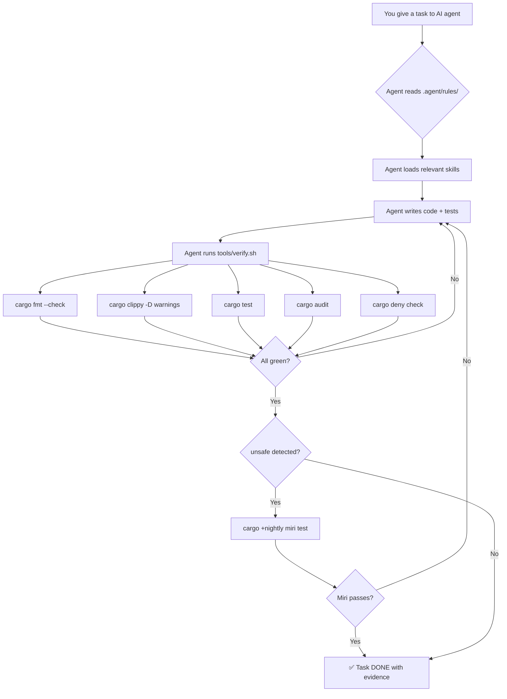

# 🦀 Rust AI Governance Pack

> **Make AI coding agents produce Rust that is verifiable, secure by default, and repeatable.**

[](https://opensource.org/licenses/Apache-2.0)
[](https://rust-lang.org)
[](CONTRIBUTING.md)

---

## The Problem

AI coding agents (Claude, Copilot, Cursor, Gemini, etc.) are increasingly writing Rust code. But here's the truth:

- **Compiling ≠ Correct.** An AI can produce code that compiles but contains logic bugs, undefined behavior in `unsafe`, or vulnerable dependencies.
- **"Trust me, it works" ≠ Evidence.** AI agents often claim code is ready without running any verification tools.
- **No structure = no consistency.** Without explicit rules, every AI session produces different quality levels.

**Rust's compiler is your best friend, but it's not enough.** You need a governance system that forces verification at every step.

## The Solution

This pack turns "write Rust correctly" into a **verifiable, automated workflow**. Drop it into any Rust repository and your AI coding agent is immediately governed by:

```
┌─────────────────────────────────────────────────────┐
│                GOVERNANCE LAYER                      │
│                                                      │
│  📜 Rules (always active)                            │
│  ├── Rust Contract (definition of done)              │
│  ├── Output Format (what the agent must return)      │
│  └── Dependency Policy (no blind crate additions)    │
│                                                      │
│  🧠 Skills (on-demand, loaded when relevant)         │
│  ├── rust-core       → ownership, errors, idioms     │
│  ├── rust-verifier   → verification loop             │
│  ├── rust-unsafe     → unsafe/FFI governance         │
│  ├── rust-supply-chain → dependency hardening        │
│  └── rust-testing    → unit, property, fuzz          │
│                                                      │
│  ⚙️  Verification Gates (automated)                  │
│  ├── cargo fmt --check                               │
│  ├── cargo clippy -- -D warnings                     │
│  ├── cargo test                                      │
│  ├── cargo audit (RustSec)                           │
│  ├── cargo deny check (licenses/bans)                │
│  └── cargo +nightly miri test (if unsafe detected)   │
│                                                      │
│  🛡️ Security                                         │
│  ├── Anti-prompt-injection rule                      │
│  ├── deny.toml (starter policy)                      │
│  └── Evidence-based output (no fabrication)          │
└─────────────────────────────────────────────────────┘
```

## Quick Start

### 1. Copy into your Rust project

```bash
# Clone this pack
git clone https://github.com/GravityZenAI/rust-ai-governance-pack.git

# Copy contents into your project root
cp -r rust-ai-governance-pack/{.agent,.github,tools,docs,prompts,deny.toml} ./your-rust-project/
```

### 2. Install Rust verification tools

```bash
# Required
rustup component add rustfmt clippy

# Recommended (supply chain)
cargo install cargo-audit cargo-deny

# Optional but strong (undefined behavior detection)
rustup toolchain install nightly
rustup +nightly component add miri

# Optional (unsafe footprint)
cargo install cargo-geiger
```

Or use the bootstrap script:
```bash
bash tools/install-dev-tools.sh
```

### 3. Run the verifier

**Linux/macOS:**
```bash
./tools/verify.sh
```

**Windows (PowerShell):**
```powershell
powershell -ExecutionPolicy Bypass -File .\tools\verify.ps1
```

If all gates pass, you'll see:
```
✅ All gates passed.
```

### 4. Tell your AI agent

When starting a Rust coding session, tell your AI:

> "This project uses `.agent/rules/` for governance. Read them before writing any code. Run `tools/verify.sh` before declaring any task DONE."

Or use the included prompt template:
```bash
cat prompts/RUST_TASK_TEMPLATE.md
```

## How It Works



## What's Inside

```
.
├── .agent/
│   ├── rules/                          # Non-negotiable rules (always active)
│   │   ├── 00-rust-contract.md         # Definition of DONE + safety defaults
│   │   ├── 01-rust-output-format.md    # Required output structure
│   │   ├── 02-rust-dependency-policy.md # Crate addition policy
│   │   └── 03-antigravity-ops-security.md # Terminal, browser, extension security
│   ├── skills/                         # On-demand knowledge (loaded when relevant)
│   │   ├── rust-core/SKILL.md          # Ownership, errors, API patterns
│   │   ├── rust-verifier/SKILL.md      # Verification loop procedure
│   │   ├── rust-unsafe/SKILL.md        # Unsafe/FFI governance
│   │   ├── rust-supply-chain/SKILL.md  # Dependency hardening
│   │   └── rust-testing/SKILL.md       # Unit, property, fuzz testing
│   └── workflows/                      # Guided procedures
│       └── rust-verify.md              # Step-by-step verification workflow
├── .github/
│   └── workflows/
│       └── rust-verify.yml             # CI pipeline (GitHub Actions)
├── docs/
│   ├── ai/
│   │   ├── RUST_PLAYBOOK.md            # Persistent playbook for the agent
│   │   ├── DECISIONS.md                # Dependency decision log
│   │   └── ERROR_PATTERNS.md           # Known error patterns + fixes
│   └── AUDIT.md                        # Security audit of this pack
├── prompts/
│   └── RUST_TASK_TEMPLATE.md           # Copy-paste task prompt
├── tools/
│   ├── verify.sh                       # Linux/macOS verifier
│   ├── verify.ps1                      # Windows PowerShell verifier
│   └── install-dev-tools.sh            # Bootstrap helper
├── katas/
│   └── README.md                       # 8 training exercises with tests
├── deny.toml                           # cargo-deny starter policy
└── README.md                           # You are here
```

## The 7 Verification Gates

| # | Gate | Tool | What it catches | Required? |
|:-:|------|------|----------------|:---------:|
| 1 | **Format** | `cargo fmt --check` | Inconsistent formatting | ✅ Always |
| 2 | **Lint** | `cargo clippy -- -D warnings` | Common mistakes, anti-patterns, footguns | ✅ Always |
| 3 | **Tests** | `cargo test` | Logic bugs, regressions | ✅ Always |
| 4 | **Vulnerabilities** | `cargo audit` | Known CVEs in dependencies | ✅ Always |
| 5 | **Policies** | `cargo deny check` | License violations, banned crates, duplicates | ✅ Always |
| 6 | **Undefined Behavior** | `cargo +nightly miri test` | Memory bugs, UB in unsafe code | ⚠️ If unsafe |
| 7 | **Unsafe Footprint** | `cargo-geiger` | Unsafe usage across dependency tree | 💡 Optional |

## Definition of DONE

A task is DONE **only** when:

- [x] A **minimal diff** exists (no unrelated refactors)
- [x] `tools/verify.sh` (or `verify.ps1`) is **GREEN**
- [x] The output includes: what changed, files touched, commands executed, results, checklist
- [x] No tool output is **fabricated** — if blocked, the agent explains why
- [x] No `unsafe` unless explicitly required and governed (isolated, documented, tested, Miri'd)

## Compatible AI Agents

This pack works with any AI coding assistant that supports project-level instructions:

| Agent | How to use |
|-------|-----------|
| **Google Antigravity** | Rules auto-loaded from `.agent/rules/`, Skills from `.agent/skills/` |
| **Claude Code** | Add rules to `CLAUDE.md` or reference `.agent/rules/` |
| **GitHub Copilot** | Reference in `.github/copilot-instructions.md` |
| **Cursor** | Add to `.cursorrules` |
| **Windsurf** | Add to `.windsurfrules` |
| **Any LLM** | Include rules in system prompt or first message |

## 🥋 Training Katas

The [`katas/`](katas/) directory contains practical exercises to benchmark how well your AI agent writes Rust:

| Kata | Concept | Error trained against |
|------|---------|---------------------|
| 01 | Ownership basics | E0382 (use after move) |
| 02 | Error handling | `unwrap_used` lint |
| 03 | Structs + Traits | E0277 (trait not impl) |
| 04 | Iterators | E0599 (method not found) |
| 05 | Lifetimes | E0106, E0515 |
| 06 | Generics + bounds | E0277 |
| 07 | Clippy compliance | Multiple lints |
| 08 | Newtype pattern | Logic bugs |

**Kata Pass Rate** = (passed / attempted) × 100% — Use this to measure your AI agent's Rust competency.

## Why Rust + AI Needs Governance

```
Without governance:                    With governance:
                                       
AI writes code ──→ "looks good" ──→ 🤞  AI writes code ──→ verify.sh ──→ ✅/❌
                                       │                                    │
Result: Hope-based development          │    ❌ → Fix → Re-verify → Loop    │
                                       │    ✅ → Evidence-based DONE        │
                                       Result: Verifiable development
```

**Key insight:** Rust correctness is not a belief — it's a chain of objective gates. The compiler is your first judge, but `clippy`, `miri`, `cargo-audit`, and `cargo-deny` complete the picture.

## Contributing

We welcome contributions! See [CONTRIBUTING.md](CONTRIBUTING.md) for guidelines.

Ideas for contributions:
- Additional skills (async patterns, WebAssembly, embedded)
- More verification gates
- Integration guides for specific AI agents
- Translations (especially Spanish, Chinese, Japanese)
- Real-world case studies

## License

[Apache License 2.0](LICENSE) — Use it commercially, modify it, distribute it. Just give credit.

## Credits

Created by **GravityZen AI** — building the future of AI-governed development.

Based on research from:
- [Rust Programming Language](https://rust-lang.org) official documentation
- [ANSSI Secure Rust Guidelines](https://anssi-fr.github.io/rust-guide)
- [RustSec Advisory Database](https://rustsec.org)
- [Microsoft Pragmatic Rust Guidelines](https://github.com/nickel-org/rust-pragmatic-guidelines)
- [Google Antigravity IDE](https://antigravity.google) Skills and Rules system

---

<p align="center">
  <strong>Stop hoping your AI writes correct Rust. Start verifying it.</strong>
</p>
