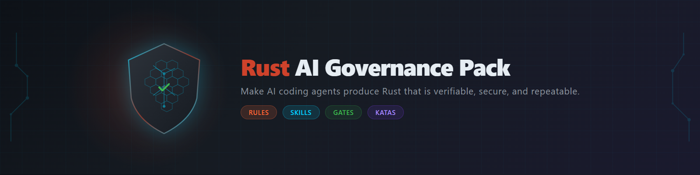
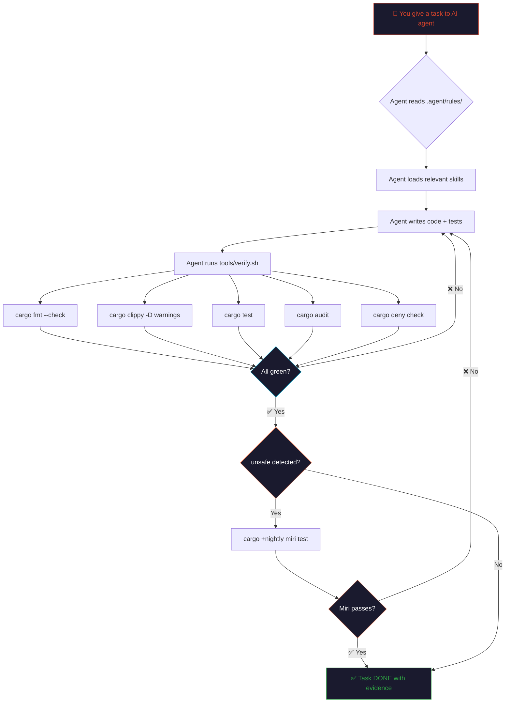

<div align="center">



# Rust AI Governance Pack

### Stop hoping your AI writes correct Rust. Start verifying it.

[](https://opensource.org/license/apache-2-0)
[](https://rust-lang.org)
[](#whats-inside)
[](#whats-inside)
[](#-training-katas)
[](CONTRIBUTING.md)

</div>

---

## The Problem

AI coding agents (Claude, Copilot, Cursor, Gemini, etc.) are increasingly writing Rust code. But here's the truth:

- **Compiling ≠ Correct.** An AI can produce code that compiles but contains logic bugs, undefined behavior in `unsafe`, or vulnerable dependencies.
- **"Trust me, it works" ≠ Evidence.** AI agents often claim code is ready without running any verification tools.
- **No structure = no consistency.** Without explicit rules, every AI session produces different quality levels.

**Rust's compiler is your best friend, but it's not enough.** You need a governance system that forces verification at every step.

## The Solution

This pack turns "write Rust correctly" into a **verifiable, automated workflow**. Drop it into any Rust repository and your AI coding agent is immediately governed by:

```
┌──────────────────────────────────────────────────────────────┐
│                    GOVERNANCE LAYER                           │
│                                                              │
│  ▸ 8 Rules (always active)                                   │
│    Rust Contract · Output Format · Dependency Policy         │
│    Ops Security · Operating Loop · Quality Bar               │
│    Repo Memory · Command Safety                              │
│                                                              │
│  ▸ 9 Skills (on-demand, loaded when relevant)                │
│    rust-core · rust-verifier · rust-unsafe                   │
│    rust-supply-chain · rust-testing · rust-compile-loop      │
│    rust-error-triage · rust-kata-coach · rust-refactor-safely│
│                                                              │
│  ▸ 8 Verification Gates (automated)                          │
│    fmt → clippy → test → audit → deny → miri → geiger → vet │
│                                                              │
│  ▸ Security                                                  │
│    Anti-prompt-injection · deny.toml · Evidence-only output  │
│    No curl|sh without review · Command safety                │
│                                                              │
│  ▸ 20 Training Katas + Level 2 challenges                    │
└──────────────────────────────────────────────────────────────┘
```

## Quick Start

### 1. Copy into your Rust project

```bash
# Clone this pack
git clone https://github.com/GravityZenAI/rust-ai-governance-pack.git

# Copy contents into your project root
cp -r rust-ai-governance-pack/{.agent,.github,tools,docs,prompts,deny.toml} ./your-rust-project/
```

### 2. Install Rust verification tools

```bash
# Required
rustup component add rustfmt clippy

# Recommended (supply chain)
cargo install cargo-audit cargo-deny

# Optional but strong (undefined behavior detection)
rustup toolchain install nightly
rustup +nightly component add miri

# Optional (unsafe footprint + supply-chain vetting)
cargo install cargo-geiger cargo-vet
```

Or use the bootstrap script:
```bash
bash tools/install-dev-tools.sh
```

### 3. Run the verifier

**Linux/macOS:**
```bash
./tools/verify.sh
```

**Windows (PowerShell):**
```powershell
powershell -ExecutionPolicy Bypass -File .\tools\verify.ps1
```

If all gates pass, you'll see:
```
✅ All gates passed.
```

### 4. Tell your AI agent

When starting a Rust coding session, tell your AI:

> "This project uses `.agent/rules/` for governance. Read them before writing any code. Run `tools/verify.sh` before declaring any task DONE."

Or use the included prompt template:
```bash
cat prompts/RUST_TASK_TEMPLATE.md
```

## How It Works



## What's Inside

```
.
├── .agent/
│   ├── rules/                          # Non-negotiable rules (always active)
│   │   ├── 00-rust-contract.md         # Definition of DONE + safety defaults
│   │   ├── 01-rust-output-format.md    # Required output structure
│   │   ├── 02-rust-dependency-policy.md # Crate addition policy
│   │   ├── 03-antigravity-ops-security.md # Terminal, browser, extension security
│   │   ├── 04-rust-operating-loop.md   # Spec-first, incremental, error memory
│   │   ├── 05-rust-quality-bar.md      # Quality bar + prohibited patterns
│   │   ├── 06-repo-memory.md           # Repository memory files system
│   │   └── 07-command-safety.md        # Command safety restrictions
│   ├── skills/                         # On-demand knowledge (loaded when relevant)
│   │   ├── rust-core/SKILL.md          # Ownership, errors, API patterns
│   │   ├── rust-verifier/SKILL.md      # Verification loop procedure
│   │   ├── rust-unsafe/SKILL.md        # Unsafe/FFI governance
│   │   ├── rust-supply-chain/SKILL.md  # Dependency hardening
│   │   ├── rust-testing/SKILL.md       # Unit, property, fuzz testing
│   │   ├── rust-compile-loop/SKILL.md  # Incremental compile→test→fix loop
│   │   ├── rust-error-triage/SKILL.md  # Systematic error diagnosis
│   │   ├── rust-kata-coach/SKILL.md    # Kata training with scoring
│   │   └── rust-refactor-safely/SKILL.md # Test-guided refactoring
│   └── workflows/                      # Guided procedures
│       ├── rust-verify.md              # Step-by-step verification workflow
│       ├── kata.md                     # Kata training workflow
│       └── log_decision.md             # Decision logging workflow
├── .github/
│   └── workflows/
│       └── rust-verify.yml             # CI pipeline (GitHub Actions)
├── ARCHITECTURE.md                     # Project architecture overview
├── docs/
│   ├── ai/
│   │   ├── RUST_PLAYBOOK.md            # Persistent playbook for the agent
│   │   ├── DECISIONS.md                # Architecture/style decision log
│   │   └── ERROR_PATTERNS.md           # 50+ known error patterns + fixes (16KB)
│   ├── AUDIT.md                        # Security audit of this pack
│   ├── AUDIT_REPORT.md                 # Detailed audit report
│   ├── DEFINITION_OF_DONE.md           # Completion criteria
│   ├── EXCEPTIONS.md                   # Exception log
│   ├── EXECUTION_PLAN.md               # Execution plan template
│   └── KATA_RUBRIC.md                  # Kata scoring rubric
├── prompts/
│   └── RUST_TASK_TEMPLATE.md           # Copy-paste task prompt
├── tools/
│   ├── verify.sh                       # Linux/macOS verifier
│   ├── verify.ps1                      # Windows PowerShell verifier
│   ├── install-dev-tools.sh            # Bootstrap helper
│   └── record_evidence.sh             # Evidence recording script
├── training/
│   └── kata_suite/                     # 20 Rust katas with tests
│       ├── Cargo.toml
│       ├── src/ (20 .rs katas + lib.rs)
│       └── tests/
├── katas/
│   └── README.md                       # Kata overview and quick reference
├── deny.toml                           # cargo-deny starter policy
└── README.md                           # You are here
```

## The 8 Verification Gates

| # | Gate | Tool | What it catches | Required? |
|:-:|------|------|----------------|:---------:|
| 1 | **Format** | `cargo fmt --check` | Inconsistent formatting | ✅ Always |
| 2 | **Lint** | `cargo clippy -- -D warnings` | Common mistakes, anti-patterns, footguns | ✅ Always |
| 3 | **Tests** | `cargo test` | Logic bugs, regressions | ✅ Always |
| 4 | **Vulnerabilities** | `cargo audit` | Known CVEs in dependencies | ✅ Always |
| 5 | **Policies** | `cargo deny check` | License violations, banned crates, duplicates | ✅ Always |
| 6 | **Undefined Behavior** | `cargo +nightly miri test` | Memory bugs, UB in unsafe code | ⚠️ If unsafe |
| 7 | **Unsafe Footprint** | `cargo-geiger` | Unsafe usage across dependency tree | 💡 Optional |
| 8 | **Supply-Chain Vet** | `cargo-vet` | Unvetted third-party code | 💡 Optional |

## Definition of DONE

A task is DONE **only** when:

- [x] A **minimal diff** exists (no unrelated refactors)
- [x] `tools/verify.sh` (or `verify.ps1`) is **GREEN**
- [x] The output includes: what changed, files touched, commands executed, results, checklist
- [x] No tool output is **fabricated** — if blocked, the agent explains why
- [x] No `unsafe` unless explicitly required and governed (isolated, documented, tested, Miri'd)

## Compatible AI Agents

This pack works with any AI coding assistant that supports project-level instructions:

| Agent | How to use |
|-------|-----------|
| **Google Antigravity** | Rules auto-loaded from `.agent/rules/`, Skills from `.agent/skills/` |
| **Claude Code** | Add rules to `CLAUDE.md` or reference `.agent/rules/` |
| **GitHub Copilot** | Reference in `.github/copilot-instructions.md` |
| **Cursor** | Add to `.cursorrules` |
| **Windsurf** | Add to `.windsurfrules` |
| **Any LLM** | Include rules in system prompt or first message |

## Training Katas

The [`training/kata_suite/`](training/kata_suite/) directory contains **20 Rust katas with Level 1 + Level 2 challenges** (27 total test cases) to benchmark AI agent Rust competency:

| Kata | Concept | L1 (Benchmark) | L2 (Deliberate Trap) |
|------|---------|----------------|---------------------|
| 01 | Borrowing | `first_word`, `count_words` | `longest_word_and_char_count` (double borrow) |
| 02 | Ownership | `push_suffix`, `append_in_place` | `maybe_prepend` (conditional move) |
| 03 | Result/Option | `parse_positive`, `safe_div` | `parse_add_divide` (chained `?` propagation) |
| 04 | Struct methods | `Counter::new/inc/add/get` | — |
| 05 | Traits | `Area` for `Rectangle`/`Circle` | — |
| 06 | Generics | `max_of`, `dedup_sorted` | — |
| 07 | Lifetimes | `longest` | — |
| 08 | Iterators | `squares`, `sum_even` | — |
| 09 | Error propagation | `read_number`, `parse_and_add` | — |
| 10 | Modules | `public_api` | — |
| 11 | Enums + match | `Command::apply` | — |
| 12 | Collections/HashMap | `word_frequencies` | — |
| 13 | Slices + strings | `trim_prefix`, `is_ascii_palindrome` | — |
| 14 | Parsing | `parse_csv_line`, `parse_pair` | — |
| 15 | RefCell basics | `Bag` (interior mutability) | — |
| 16 | Split borrow | `sum_and_bump_two` | — |
| 17 | Into/From | `Kilometers` → `Meters` | — |
| 18 | Builder pattern | `UserBuilder` | — |
| 19 | Threads | `parallel_sum` | — |
| 20 | Small parser | `sum_expr` | — |

**Level 2 challenges** are deliberately designed traps that exploit common AI mistakes (E0382, E0502, unwrap abuse). The AI agent must detect the pattern and produce idiomatic Rust.

```bash
cd training/kata_suite && cargo test
```

**Kata Pass Rate** = (passed / attempted) × 100% — Use this to measure your AI agent's Rust competency. See [KATA_RUBRIC.md](docs/KATA_RUBRIC.md) for scoring details.

## Why This Exists

<table>
<tr>
<td width="50%">

### ❌ Without Governance

```
AI writes code
     ↓
"looks good to me"
     ↓
🤞 Hope-based development
     ↓
💀 Bugs in production
```

</td>
<td width="50%">

### ✅ With Governance

```
AI writes code
     ↓
verify.sh runs 7 gates
     ↓
❌ → Fix → Re-verify → Loop
✅ → Evidence-based DONE
     ↓
🛡️ Verifiable development
```

</td>
</tr>
</table>

> **Key insight:** Rust correctness is not a belief — it's a chain of objective gates. The compiler is your first judge, but `clippy`, `miri`, `cargo-audit`, and `cargo-deny` complete the picture.

## Contributing

We welcome contributions! See [CONTRIBUTING.md](CONTRIBUTING.md) for guidelines.

Ideas for contributions:
- Additional skills (async patterns, WebAssembly, embedded)
- More verification gates
- Integration guides for specific AI agents
- Translations (especially Spanish, Chinese, Japanese)
- Real-world case studies

## License

[Apache License 2.0](LICENSE) — Use it commercially, modify it, distribute it. Just give credit.

## Credits

Created by **GravityZen AI** — building the future of AI-governed development.

Based on research from:
- [Rust Programming Language](https://rust-lang.org) official documentation
- [ANSSI Secure Rust Guidelines](https://anssi-fr.github.io/rust-guide)
- [RustSec Advisory Database](https://rustsec.org)
- [Microsoft Pragmatic Rust Guidelines](https://github.com/nickel-org/rust-pragmatic-guidelines)
- [Google Antigravity IDE](https://antigravity.google) Skills and Rules system

---

<div align="center">
  <br>
  <strong>Rust correctness is not a belief — it's a chain of objective gates.</strong>
  <br><br>
  <sub>Built by <a href="https://github.com/GravityZenAI">GravityZen AI</a> · Governed development for the AI era</sub>
</div>
